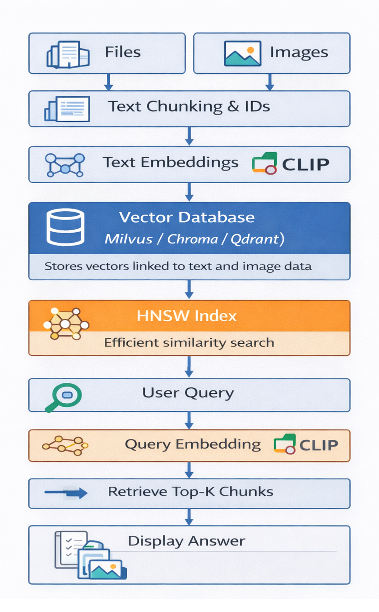

# Vector Database Benchmarking for Semantic Search

## Overview

This project focuses on benchmarking multiple vector databases for semantic search performance and evaluating their effectiveness within a Retrieval Augmented Generation (RAG) pipeline. The system analyzes how efficiently different databases retrieve relevant results using text embeddings and how retrieval quality impacts downstream generation tasks.

The pipeline includes:

* Dataset ingestion (Wikipedia-based text corpus)
* Embedding generation using transformer models
* Storage and retrieval using vector databases
* Integration with RAG based workflows
* Evaluation based on recall and latency

---

## System Flow Diagram



---

## Objectives

* Compare performance of vector databases (Chroma, Qdrant, Milvus)
* Analyze retrieval quality using recall metrics
* Measure query latency across systems
* Evaluate impact of retrieval on RAG pipelines

---

## System Architecture

1. Load dataset (text files / Wikipedia corpus)
2. Generate embeddings using transformer models
3. Store embeddings with metadata in vector database
4. Perform similarity search for queries
5. Retrieve top-k relevant documents
6. Feed retrieved context into RAG pipeline
7. Evaluate results using recall and latency metrics

---

## Tech Stack

* **Programming Language**: Python
* **Embedding Models**: SentenceTransformers, BGE, E5
* **Vector Databases**: Chroma, Qdrant, Milvus
* **Libraries**: PyTorch, Transformers
* **Environment**: Windows, WSL, IU RED (Linux)

---

## Project Structure

```
PROJECT/
│── phase_1/                 # Initial pipeline experiments
│── phase_2/                 # Extended pipeline with modular design
│   │── chroma_storage/      # Persistent Chroma storage
│   │── qdrant_storage/      # Persistent Qdrant storage
│   │── vector_db/           # Database-specific implementations
│   │   │── chroma_db.py
│   │   │── qdrant_db.py
│   │   │── milvus_db.py
│   │── wiki_dataset/        # Text dataset
│   │   │── 12345.txt
│   │   │── 67890.txt
│   │   │── ...
│   │── wit_images/          # Image dataset (multimodal)
│   │   │── img_0000.png
│   │   │── img_0001.png
│   │   │── ...
│   │── wit_metadata/        # Metadata for WIT dataset JSON
│   │── embedder.py          # Embedding generation logic
│   │── model_loader.py      # Model loading utilities
│   │── data_loader.py       # Dataset loading
│   │── query_engine.py      # Query execution logic
│   │── query_loader.py      # Query dataset loader
│   │── display.py           # Result visualization
│   │── main.py              # Entry point for benchmarking
│   │── queries.json         # Input queries
│── requirements.txt
│── README.md
```

---

## Setup Instructions

### 1. Clone Repository

```bash
git clone <your-repo-link>
cd <repo-name>
```

### 2. Create Virtual Environment

```bash
python -m venv venv
venv\Scripts\activate   # Windows
```

### 3. Install Dependencies

```bash
pip install -r requirements.txt
```

---

## Running the Project

Run benchmarking for a specific database:

```bash
python main.py --db chroma
python main.py --db qdrant
python main.py --db milvus
```

---

## Evaluation Metrics

* **Recall**
  Measures whether relevant documents are retrieved

* **Latency**
  Time taken to return results per query

---

## Current Progress

* Designed modular benchmarking pipeline
* Integrated Chroma and Qdrant
* Configured Milvus using Docker and RED environment
* Implemented recall and latency based evaluation
* Established foundation for RAG based retrieval evaluation

---

## Sample Results

| Database | Recall | Avg Latency (ms) |
| -------- | ------ | ---------------- |
| Chroma   | 0.78   | 45               |
| Qdrant   | 0.82   | 52               |
| Milvus   | 0.85   | 60               |

